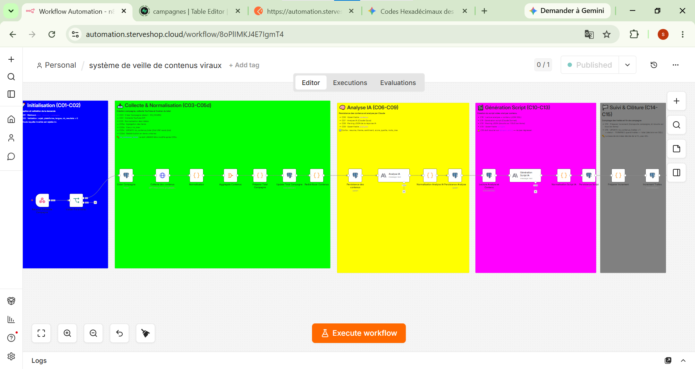
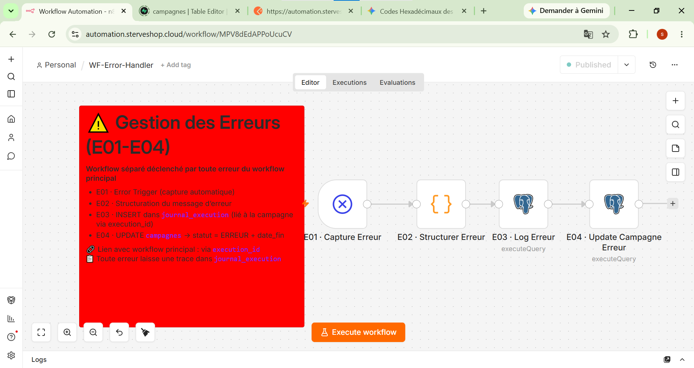
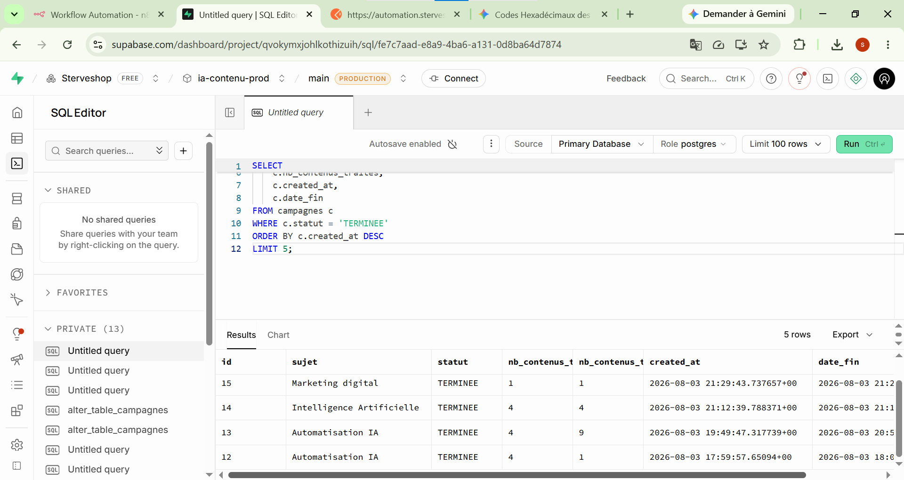
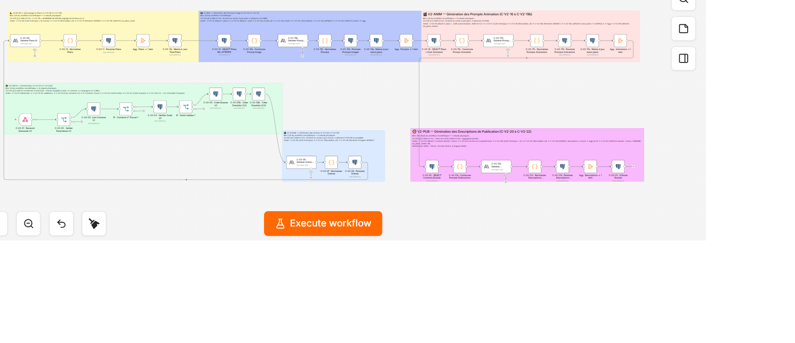
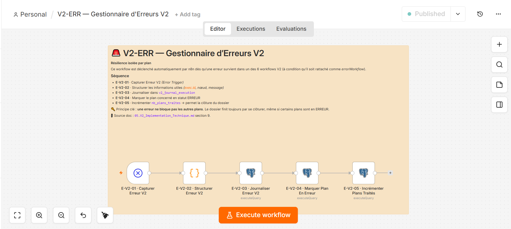
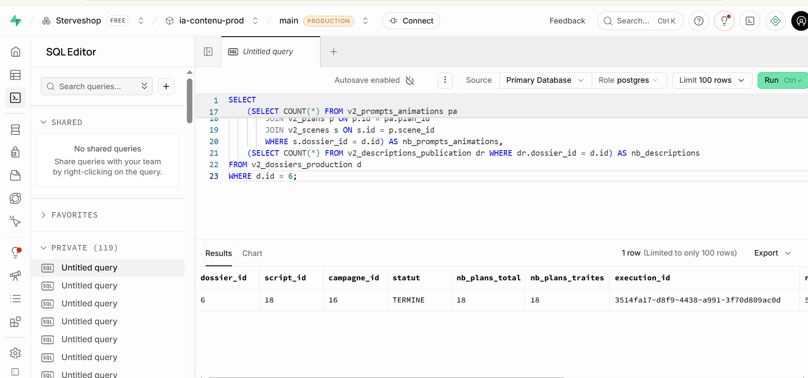

# 🎬 Créateur de Contenu IA — Automated Content Intelligence Pipeline

> Système automatisé de veille, génération de scripts vidéo courts et **préparation complète des dossiers de production**, basé sur **n8n**, **PostgreSQL** et **Claude AI**.

---
## 🎯 Le problème

Un créateur de contenu IA passe **plusieurs heures par jour** à :

1. Faire de la veille sur les tendances et analyser ce qui fonctionne.
2. Rédiger des scripts pour ses vidéos courtes (TikTok, YouTube Shorts, Reels).
3. **Découper mentalement chaque script en scènes, imaginer les visuels, rédiger un prompt image et un prompt animation par plan, puis préparer les descriptions et hashtags pour chaque plateforme.**

Ces tâches sont **répétitives, chronophages et sans valeur ajoutée créative directe**. Elles épuisent son énergie mentale avant même qu'il ait ouvert son outil de génération.

## 💡 La solution — Pipeline en 2 versions

Un pipeline automatisé en deux étages, chacun résolvant un problème métier distinct :

### 🅰️ V1 STABLE — Génération de scripts

À partir d'un simple sujet :

1. **Collecte** N contenus depuis YouTube via l'API officielle
2. **Analyse** chaque contenu par IA (résumé, thème, sentiment, score de qualité, mots-clés)
3. **Génère** un script vidéo prêt-à-tourner de moins de 60 secondes (hook + corps + CTA)
4. **Historise** l'ensemble dans PostgreSQL avec traçabilité complète
5. **Supervise** l'avancement en temps réel
6. **Gère les incidents** via un workflow d'erreur dédié

### 🅱️ V2 STABLE — Dossier de production complet

À partir d'un script V1 + du choix d'un outil image + du choix d'un outil animation :

1. **Découpe** le script en scènes narratives (2 à 5 par script)
2. **Subdivise** chaque scène en plans visuels (2 à 4 par scène)
3. **Génère un prompt image optimisé par plan**, adapté à l'outil image choisi
4. **Génère un prompt animation optimisé par plan**, adapté à l'outil animation choisi
5. **Produit 3 jeux de descriptions/hashtags** optimisés pour TikTok, YouTube Shorts et Instagram Reels
6. **Clôture le dossier** avec suivi d'avancement via checklist en 9 étapes

**Résultat combiné (V1 + V2)** :

> Ce qui prenait **3+ heures de travail manuel** se fait en **~5 minutes de traitement automatique**. Le créateur récupère un dossier complet et peut se concentrer sur son cœur de métier : générer les visuels dans ses outils, monter et publier.

---
## 📸 Aperçu

### V1 — Workflow principal

### V1 — Workflow d'erreur

### V1 — Résultat en base

### V2 — Workflow monolithique complet

### V2 — Workflow d'erreur

### V2 — Dossier de production terminé

---

---
## 🛠️ Stack technique

| Couche | Techno |
|--------|--------|
| Orchestration | **n8n** (self-hosted) |
| Base de données | **PostgreSQL 16** (Supabase) |
| IA — Analyse sémantique (V1) | **Claude Opus** (Anthropic) |
| IA — Génération créative (V1 + V2) | **Claude Sonnet 5** (Anthropic) |
| Source de données (V1) | **YouTube Data API v3** |
| Outils image supportés (V2) | Playground AI, SeaArt AI, Tensor.Art, Midjourney |
| Outils animation supportés (V2) | Kling AI, Pika, Hailuo AI, Runway Gen-3 Alpha |

---
## ✨ Ce que ce projet démontre

Ce n'est pas juste "un workflow n8n". C'est une **démarche d'architecte** appliquée à un projet réel, sur deux itérations successives :

- 🧠 **Pensée architecturale** : séparation stricte des responsabilités, workflow d'erreur indépendant, corrélation par identifiant technique, extension V2 sans refonte V1.
- 📐 **Modélisation métier avant technique** : contexte, besoin, modèle de données, contrats d'interface — tout est documenté avant chaque ligne de code.
- 🔒 **Idempotence garantie** : UPSERT systématiques sur les clés métier, aucune duplication même en cas de relance.
- 📊 **Observabilité native** : compteurs, statuts et journaux d'exécution en base.
- 🧪 **Testabilité rigoureuse** : chaque bloc V2 testé unitairement + 2 tests end-to-end complets.
- 📚 **Traçabilité des décisions** : 19 ADR pour la V1 + 7 ADR pour la V2.
- 🎯 **Livrables versionnés** : `v1.0.0-stable` et `v2.0.0-stable` sur GitHub, tags immuables.
- 🧑‍🎨 **Respect du persona** : la V2 libère l'énergie mentale du créateur pour la partie créative.

---
## 📖 Documentation

La documentation complète est dans [`00_Documentations/`](./00_Documentations/).

### 📁 Documentation V1

| Document | Rôle |
|----------|------|
| [`00_Contexte_Du_Client`](./00_Documentations/00_Contexte_Du_Client.md) | Qui est le client, son activité, ses outils |
| [`01_Besoin_Client`](./00_Documentations/01_Besoin_Client.md) | Le problème métier V1 à résoudre |
| [`02_Architecture_metier`](./00_Documentations/02_Architecture_metier.md) | Vue métier du système V1 |
| [`03_Architecture_des_Workflows`](./00_Documentations/03_Architecture_des_Workflows.md) | Cycle de vie V1 |
| [`04_Specification_des_Composants`](./00_Documentations/04_Specification_des_Composants.md) | Composants V1 |
| [`05_Implementation_Technique`](./00_Documentations/05_Implementation_Technique.md) | Configuration V1 dans n8n |
| [`06_Journal_des_Decisions_d_Architecture`](./00_Documentations/06_Journal_des_Decisions_d_Architecture.md) | 19 ADR V1 |
| [`07_Plan_de_tests`](./00_Documentations/07_Plan_de_tests.md) | 47 scénarios de tests V1 |

### 📁 Documentation V2

| Document | Rôle |
|----------|------|
| [`01.V2_Besoin_Client`](./00_Documentations/01.V2_Besoin_Client.md) | Le problème métier V2 à résoudre |
| [`04.V2_Specification_des_Composants`](./00_Documentations/04.V2_Specification_des_Composants.md) | Prompts système des LLM V2 |
| [`04.1.V2_Catalogue_Outils`](./00_Documentations/04.1.V2_Catalogue_Outils.md) | Catalogue `v2_outils` |
| [`05.V2_Implementation_Technique`](./00_Documentations/05.V2_Implementation_Technique.md) | Spécifications des nœuds V2 |
| [`06.V2_Journal_des_Decisions_d_Architecture`](./00_Documentations/06.V2_Journal_des_Decisions_d_Architecture.md) | 7 ADR V2 |
| [`07.V2_Plan_de_tests`](./00_Documentations/07.V2_Plan_de_tests.md) | Cas de tests V2 |

### 📁 Suivi projet

| Document | Rôle |
|----------|------|
| [`08_Project_Tracker`](./00_Documentations/08_Project_Tracker.md) | Suivi d'avancement V1 + V2 |

---
## 🚀 Installation

### Prérequis

- n8n (v1.60+ recommandé)
- PostgreSQL 16 (ou Supabase)
- Un compte Anthropic (API key, modèles Opus + Sonnet 5)
- Un compte Google Cloud avec YouTube Data API v3 activée *(V1 uniquement)*

### 1. Lancer une campagne V1

curl -X POST https://votre-instance-n8n.com/webhook/lancer-campagne \
  -H "Content-Type: application/json" \
  -d '{
    "sujet": "Automatisation IA",
    "plateforme": "YouTube",
    "langue": "fr",
    "nb_resultats": 5
  }'

  ### 2. Lancer la génération d'un dossier de production V2
  curl -X POST https://votre-instance-n8n.com/webhook/v2-creer-dossier \
  -H "Content-Type: application/json" \
  -d '{
    "script_id": 18,
    "outil_image_id": 1,
    "outil_animation_id": 5
  }'
  ---

## 🗺️ Roadmap

- ✅ **V1 STABLE** — Pipeline complet : collecte → analyse → script (livré le 03/08/2025)
- ✅ **V2 STABLE** — Backend complet : script → scènes → plans → prompts image/animation → descriptions publications (livré le 10/08/2026)
- 🟡 **V2.1 Frontend** — Tableau de bord personnel de suivi des dossiers de production (en cadrage)
- ⬜ **V3+** — Post-production : voix off, montage assemblé, publication automatique multi-plateformes

---

## 👤 Auteur

**Sterve**  
🔗 [LinkedIn](https://www.linkedin.com/in/sterve-ai)  
💡 *Turning ideas into AI-powered automations | n8n • PostgreSQL • Claude AI*

---

## 📄 Licence

Ce projet est distribué sous licence [MIT](LICENSE).